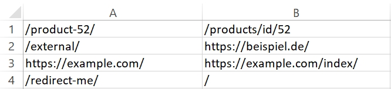
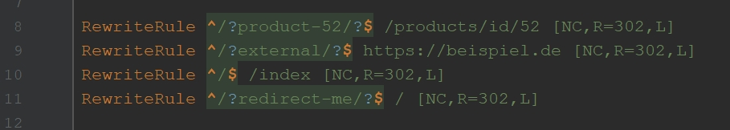

# Features

Turns this:



into this:



# Compile

The project has a Makefile included. If you run `make` (or your OS' equivalent, e.g. `mingw32-make` on Windows) in the root directory of the project, you will receive a compiled file in a subfolder called `bin`.

# Usage

The basic usage is as follows:

```
./csv_to_htaccess <csv path> [--prefix path/to/prefix] [--suffix path/to/suffix]
```

The CSV has to have the following columns (with no header line):

1. **FROM** - the path to redirect from. Can be a full URL, the domain part will be removed.
2. **TO** - the path to redirect to. Can be a full URL, will be removed if it matches the FROM URL.
3. (optional) **STATUS_CODE** - The program will use Status Code 302 for every redirect, unless specified here.

The columns 4 and up are ignored by the program, you can freely use them for e.g. comments.

The resulting file will be placed in the same directory and will follow this schema:

```
# Contents of your prefix file, or empty

# generated redirects

# contents of your suffix file, or empty
```

The pre- and suffix files have to be text files. Binary files lead to undefined behavior.

# Support

No external documentation exists. If you encounter a problem, please raise a Github issue.

# License

**CSV to .htaccess**  
**Copyright (C) 2019  Nicholas Passon**  

This program is free software: you can redistribute it and/or modify  it under the terms of the GNU Affero General Public License as published by the Free Software Foundation, either version 3 of the License, or (at your option) any later version. This program is distributed in the hope that it will be useful, but WITHOUT ANY WARRANTY; without even the implied warranty of MERCHANTABILITY or FITNESS FOR A PARTICULAR PURPOSE.  See the GNU Affero General Public License for more details. 

You should have received a copy of the GNU Affero General Public License along with this program.  If not, see <http://www.gnu.org/licenses/>.
